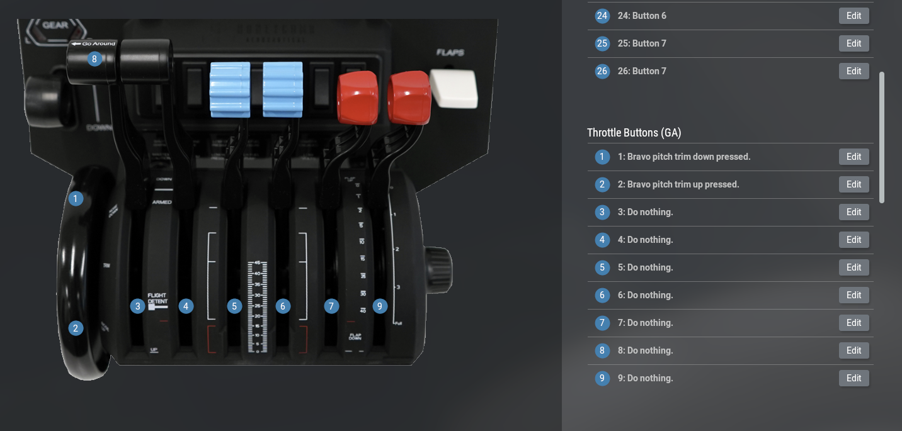

# Install

1. Download `xa-honeycombo.zip` from the [Release Page](https://github.com/x-z7a/zoal-honeycomb/releases/latest).
2. Drop the folder into X-Plane's plugins folder.
3. See the mappings below for knobs and AP buttons.
4. A GUI tool is included to help add/change profiles, but it is currently read-only. On macOS you might need:

```bash
chmod -R 755 bravo.app
```

## Bravo Knobs Mapping


## Bravo AP Buttons Mapping


Mappings can be found by searching `honeycomb` after clicking `Edit` in X-Plane.


## *EXPERIMENTAL Smooth Trim Wheel

Use plugin's trim up/down



## UI Current State


