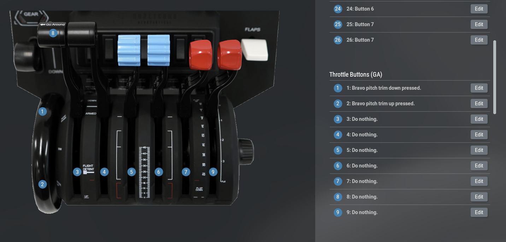

# Install

1. Download `zoal-honeycomb.zip` from the [Release Page](https://github.com/x-z7a/zoal-honeycomb/releases/latest).
2. Drop the folder into X-Plane's plugins folder.
3. Start X-Plane with the Bravo connected.

## Raw HID Input

The plugin reads the Honeycomb Bravo directly over HID, so no manual joystick/button mapping is required in X-Plane for the controls it owns.

On macOS, the Bravo is opened in shared mode so X-Plane can still see the device for axes and other controls.

The following controls are handled by the plugin automatically:

- AP buttons
- selector positions
- rotary encoder up/down
- trim wheel up/down

Leave those controls unassigned in X-Plane to avoid duplicate inputs.

Flaps remain an X-Plane assignment. If you use the Bravo flap lever, keep that bound in X-Plane instead of the plugin.

## Smooth Trim Wheel

The trim wheel is read directly over HID. Profile trim commands override the defaults; otherwise the plugin falls back to X-Plane's generic trim commands.

Watch the demo video:

<iframe width="560" height="315" src="https://www.youtube.com/embed/vriTIxtnZcE" title="YouTube video" frameborder="0" allowfullscreen></iframe>

## GUI Configurator

